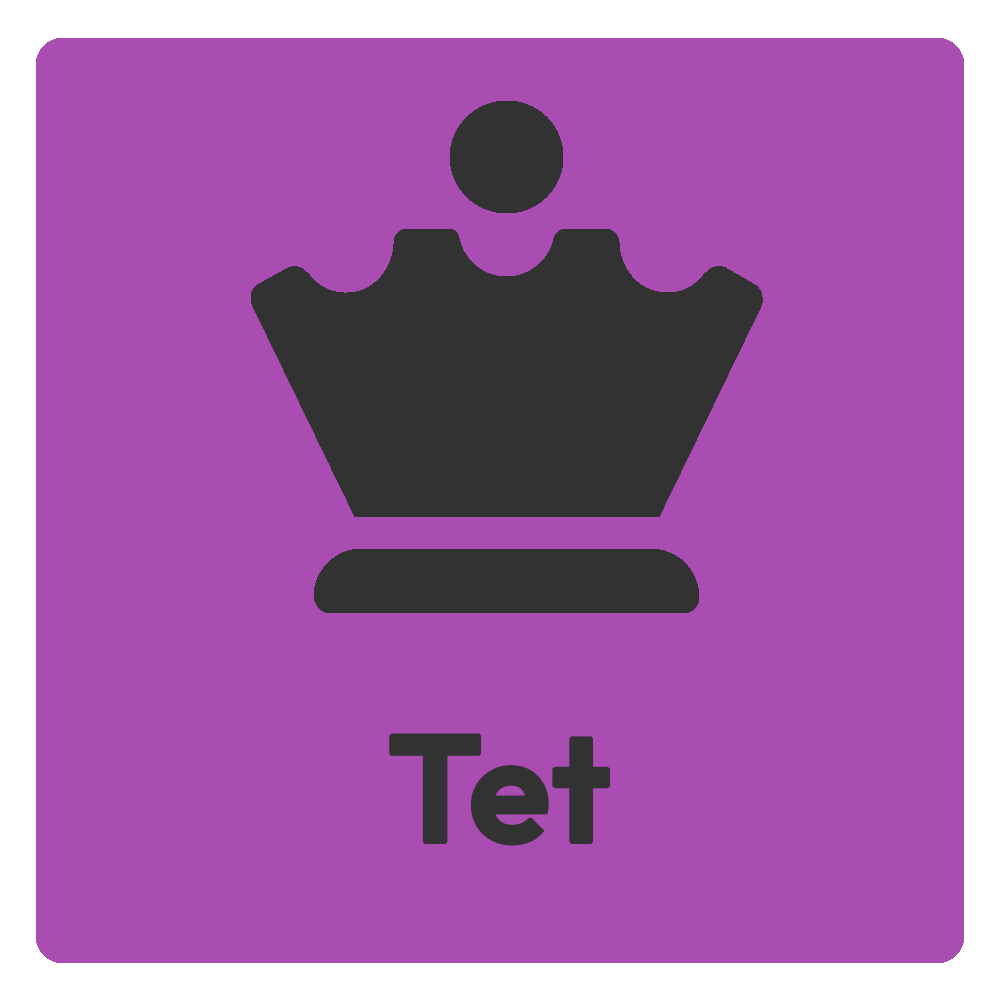

<p align="center">
    
    <h5 align="center"><b>Tet, The god of games</b></h5>
    <p align="center">an open-source RPG discord bot</p>
</p>

<hr>
<p align="center">
    <a alt="Discord Server">
        <a href="https://discord.gg/4GYN6bV"></a>
    </a>
    <a>
        
    </a>
    <a>
        
    </a>
    <a alt="contributors">
        
    </a>
</p>


### Topics:
<ul>
    <li><a href="#getting-started">📃 Getting Started</a></li>
    <li><a href="#how-to-use">📚 How to Use</a></li>
    <li><a href="#stream">🎥 Stream</a></li>
    <li><a href="https://github.com/GumpFlash/Tet/wiki">📖 Wiki</a></li>
    <li><a href="#contribute">👷 Contribute</a></li>
    <li><a href="#translate">💻 Translate</a></li>
    <li><a href="https://www.paypal.com/cgi-bin/webscr?cmd=_donations&business=gump.flash%40gmail.com&currency_code=BRL" target="_blank">💸 Donate</a></li>
    <li><a href="https://github.com/GumpFlash/Tet/blob/main/LICENSE" target="_blank">💼 Licence</a></li>
</ul>


### Getting Started
Just [Click here](https://discord.com/oauth2/authorize?client_id=751260506995818606&scope=bot&permissions=502426744) to invite Tet to your server.


### How to Use
The default prefix is '.', to get help type '.help'<br/>

<table>
    <tr>
        <th>Command</th>
        <th>Alias</th>
        <th>Arguments</th>
        <th>Description</th>
        <th>Permission</th>
    </tr>
    <tr>
        <td>Help</td>
        <td>help, commands, ajuda, comandos</td>
        <td></td>
        <td>Show all commands you can execute</td>
        <td>None</td>
    </tr>
    <tr>
        <td>Dice</td>
        <td>roll, dice, rolar, dado, 🎲</td>
        <td>[Dice operation](Send a dice equation, like: "3d20+4", will roll 3 d20 and add 4)</td>
        <td>Roll a dice, with operations</td>
        <td>None</td>
    </tr>
    <tr>
        <td>TTS</td>
        <td>tts</td>
        <td>[on|off]</td>
        <td>Turn on or off the TTS in your voice channel, will narrate dice and others commands</td>
        <td>ADMINISTRATOR</td>
    </tr>
    <tr>
        <td>Say</td>
        <td>say, voice, falar, voz</td>
        <td>[Message]</td>
        <td>Say the message in voice, but only if TTS is on</td>
        <td>SEND_TTS_MESSAGES</td>
    </tr>
    <tr>
        <td>Change Language</td>
        <td>lang, language, linguagem, idioma</td>
        <td>[Avalable Languages](pt-br|en-us)</td>
        <td>Change the bot language in your server</td>
        <td>ADMINISTRATOR</td>
    </tr>
</table>
for more details <a href="https://github.com/GumpFlash/Tet/wiki">Click Here</a> to access the wiki!


### Stream
You can display dice results in your livestream using Tet Stream System, just use the following URL:
```
   http://deuterium.com.br:3355/?serverId=(your server id)
   //or you can make for each player
   http://deuterium.com.br:3355/?serverId=(your server id)&userId=(user id)
```


### Contribute
Submit your PR to help us be better, even if it's minor changes, don't be afraid
to understand the code <a href="https://github.com/GumpFlash/Tet/wiki">Click Here</a> to access the wiki!


### Translate
Help us and translate Tet to your language, just go to folder 'lang' and create a json to your language, like 'pt-BR.json' translate the sentences and submit your PR.
